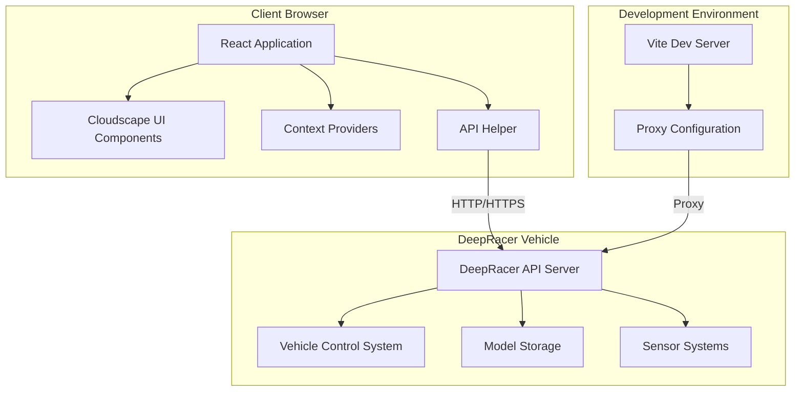
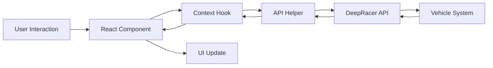

# Design Document

## Overview

The DeepRacer Custom Console is a modern React-based web application that provides a comprehensive interface for managing AWS DeepRacer vehicles. The system follows a client-server architecture where the React frontend communicates with the DeepRacer's onboard API server through RESTful endpoints. The application is built using TypeScript, Vite, and AWS Cloudscape Design System components to ensure type safety, performance, and consistent UI/UX.

The architecture emphasizes real-time communication, responsive design, and robust error handling to provide a reliable interface for vehicle control and management. The system supports both development and production environments with configurable proxy settings for local development against remote DeepRacer vehicles.

## Architecture

### High-Level Architecture



### Component Architecture

The application follows a hierarchical component structure with clear separation of concerns:

- **App Layer**: Main routing and authentication logic
- **Layout Layer**: Base layout components and navigation
- **Page Layer**: Feature-specific page components
- **Component Layer**: Reusable UI components
- **Context Layer**: Global state management
- **Service Layer**: API communication and data transformation

### Data Flow Architecture



## Components and Interfaces

### Core Application Components

#### 1. App Component (`app.tsx`)
- **Purpose**: Main application router and authentication wrapper
- **Key Features**:
  - Route protection with authentication checks
  - Conditional routing based on hostname (deepracer.aws vs local)
  - Context provider integration
- **Dependencies**: React Router, Authentication Context

#### 2. Base App Layout (`base-app-layout.tsx`)
- **Purpose**: Common layout structure for all pages
- **Key Features**:
  - Navigation panel integration
  - Content area management
  - Responsive design support
- **Dependencies**: Cloudscape AppLayout, Navigation Panel

#### 3. Navigation Panel (`navigation-panel.tsx`)
- **Purpose**: Side navigation with system status display
- **Key Features**:
  - Menu navigation with active state management
  - Battery status monitoring
  - Network information display
  - Emergency stop functionality
- **Dependencies**: Cloudscape SideNavigation, Battery Context, Network Context

### Page Components

#### 1. Home Page (`home.tsx`)
- **Purpose**: Vehicle control interface
- **Key Features**:
  - Joystick control component
  - Camera feed display
  - Sensor status monitoring
  - Throttle control
  - Inference mode management

#### 2. Models Page (`models.tsx`)
- **Purpose**: AI model management
- **Key Features**:
  - Model listing with metadata
  - File upload functionality
  - Model deletion with confirmation
  - Pagination support

#### 3. Calibration Page (`calibration.tsx`)
- **Purpose**: Vehicle calibration interface
- **Key Features**:
  - Steering calibration workflow
  - Speed calibration workflow
  - Real-time calibration value display

#### 4. Settings Page (`settings.tsx`)
- **Purpose**: Application configuration
- **Key Features**:
  - User preferences management
  - System configuration options

#### 5. Logs Page (`logs.tsx`)
- **Purpose**: System diagnostics and monitoring
- **Key Features**:
  - Log entry display
  - Real-time log updates
  - Log filtering and search

### Context Providers and State Management

#### 1. Authentication Context
```typescript
interface AuthContextType {
  isAuthenticated: boolean;
  login: () => void;
  logout: () => void;
}
```

#### 2. Battery Context
```typescript
interface BatteryContextType {
  level: number;
  error: boolean;
  hasInitialReading: boolean;
}
```

#### 3. Network Context
```typescript
interface NetworkContextType {
  ssid: string | null;
  ipAddresses: string[];
}
```

#### 4. Models Context
```typescript
interface ModelsContextType {
  models: Model[];
  reloadModels: () => Promise<void>;
}
```

### API Integration Layer

#### API Helper Class
- **Purpose**: Centralized HTTP communication with error handling
- **Key Features**:
  - GET and POST method abstractions
  - Automatic error handling and redirects
  - Timeout management
  - Authentication error handling

#### API Endpoints Integration
- `/api/login` - User authentication
- `/api/start_stop` - Vehicle control
- `/api/emergency_stop` - Emergency vehicle stop
- `/api/get_calibration/*` - Calibration data retrieval
- `/api/set_calibration_mode` - Calibration mode activation
- `/api/models/*` - Model management operations
- `/api/sensor_status` - Sensor status monitoring
- `/api/battery_status` - Battery level monitoring

## Data Models

### Core Data Structures

#### 1. Model Interface
```typescript
interface Model {
  name: string;
  sensors: string;
  training_algorithm: string;
  action_space_type: string;
  size: string;
  creation_time: number;
}
```

#### 2. Sensor Status Interface
```typescript
interface SensorStatusResponse {
  success: boolean;
  camera_status: string;
  stereo_status: string;
  lidar_status: string;
}
```

#### 3. Calibration Data Interface
```typescript
interface CalibrationResponse {
  success: boolean;
  mid: string;
  max: string;
  min: string;
  polarity: string;
}
```

#### 4. API Response Pattern
```typescript
interface BaseApiResponse {
  success: boolean;
  message?: string;
  reason?: string;
}
```

### State Management Patterns

#### 1. Local Component State
- Used for UI-specific state (form inputs, modal visibility)
- Managed with React useState hook
- Scoped to individual components

#### 2. Context-Based Global State
- Used for shared application state (authentication, battery, network)
- Implemented with React Context API
- Provides centralized state management without external dependencies

#### 3. Server State Synchronization
- Real-time data fetching from DeepRacer API
- Polling-based updates for status information
- Error handling and retry logic

## Error Handling

### Client-Side Error Handling

#### 1. API Error Categories
- **Authentication Errors (401)**: Redirect to login page
- **Server Errors (5xx)**: Redirect to system unavailable page
- **Network Errors**: Connection timeout and retry logic
- **Validation Errors**: Form validation and user feedback

#### 2. Error Boundary Implementation
- Component-level error boundaries for graceful degradation
- Global error handling for unhandled exceptions
- User-friendly error messages and recovery options

#### 3. Network Resilience
- Automatic retry mechanisms for transient failures
- Timeout configuration for API requests
- Fallback UI states for offline scenarios

### Server Communication Error Handling

#### 1. Connection Management
- Proxy configuration for development environment
- HTTPS/HTTP protocol handling
- CORS configuration for cross-origin requests

#### 2. Authentication Flow
- Cookie-based session management
- Automatic token refresh handling
- Secure logout and session cleanup

## Testing Strategy

### Unit Testing Framework

#### 1. Testing Stack
- **Vitest**: Primary testing framework
- **React Testing Library**: Component testing utilities
- **Jest DOM**: DOM assertion matchers
- **MSW (Mock Service Worker)**: API mocking

#### 2. Test Categories
- **Component Tests**: UI component behavior and rendering
- **Hook Tests**: Custom hook functionality and state management
- **Integration Tests**: Component interaction and data flow
- **API Tests**: Service layer and error handling

#### 3. Test Coverage Areas
- User authentication flows
- Vehicle control interactions
- Model management operations
- Calibration workflows
- Error handling scenarios

### End-to-End Testing

#### 1. E2E Framework
- **Playwright**: Browser automation and testing
- **Cross-browser Testing**: Chrome, Firefox, Safari support
- **Mobile Responsive Testing**: Various viewport sizes

#### 2. E2E Test Scenarios
- Complete user workflows from login to vehicle control
- Model upload and management processes
- Calibration procedures
- Network configuration changes
- Error recovery scenarios

### Testing Environment Configuration

#### 1. Development Testing
- Mock API responses for isolated component testing
- Test data fixtures for consistent test scenarios
- Hot reload support for rapid test development

#### 2. CI/CD Integration
- Automated test execution on code changes
- Test coverage reporting and enforcement
- Performance regression testing

## Security Considerations

### Authentication and Authorization
- Cookie-based session management with secure flags
- CSRF protection through token validation
- Session timeout and automatic logout

### Network Security
- HTTPS enforcement for production deployments
- Secure proxy configuration for development
- Input validation and sanitization

### Data Protection
- Sensitive data handling in local storage
- Secure API communication protocols
- User privacy protection in logging and monitoring

## Performance Optimization

### Frontend Performance
- Code splitting and lazy loading for route-based chunks
- Component memoization for expensive renders
- Efficient state updates and re-render optimization

### Network Performance
- Request batching and caching strategies
- Optimized payload sizes for API communication
- Real-time data streaming optimization

### Build Optimization
- Vite-based build system for fast development and production builds
- Asset optimization and compression
- Tree shaking for minimal bundle sizes